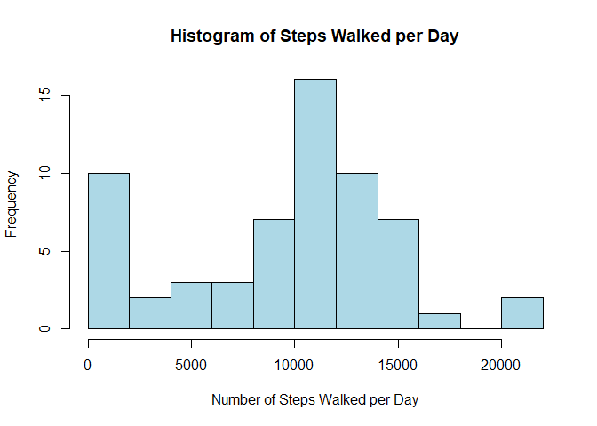
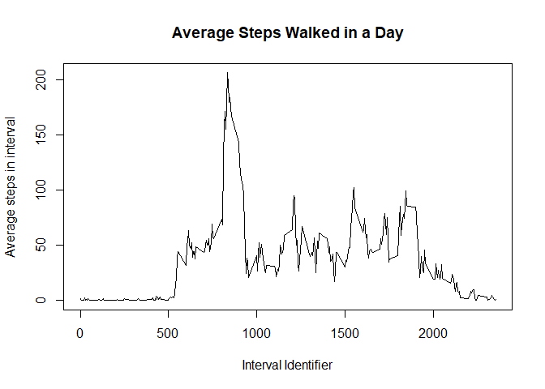
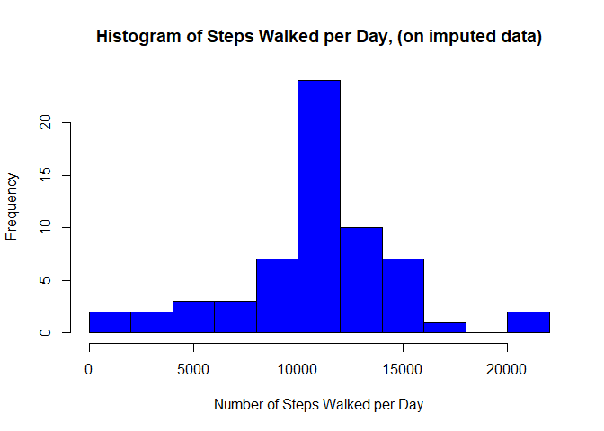
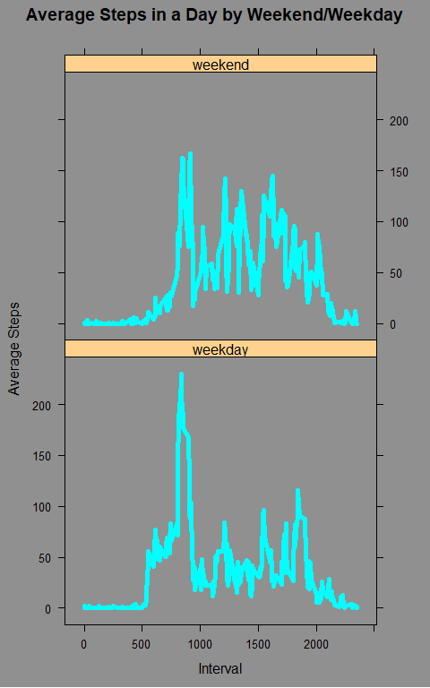

## Loading and preprocessing the data

```r
library(lubridate,warn.conflicts=FALSE)
#Read in data
actData <- read.csv('./activity/activity.csv')
#Parse the date column using lubridate
actData$date <- ymd(actData$date)
```


## What is mean total number of steps taken per day?

```r
#Create an array of total steps, one value for each day data was collected
stepsPerDay <- tapply(actData$steps,actData$date,function(x){sum(x,na.rm=TRUE)})
#Plot data
hist(stepsPerDay,breaks=10,col='light blue',
    xlab='Number of Steps Walked per Day',
    main='Histogram of Steps Walked per Day')
```

<!-- -->

```r
#Compute the mean and median of daily step totals
meanSteps <- mean(stepsPerDay,na.rm=TRUE)
medianSteps <- median(stepsPerDay,na.rm=TRUE)
print(meanSteps)
```

```
## [1] 9354.23
```

```r
print(medianSteps)
```

```
## [1] 10395
```
The mean steps per day is 9354.2295082, the median is 10395


## What is the average daily activity pattern?

```r
library(dplyr,warn.conflicts=FALSE)
#Group the data by interval berfore summarising each interval by the mean steps within it accross all days
activityPerInterval <- group_by(actData,interval) %>% 
                        summarise(ave = mean(steps,na.rm=TRUE))

#Plot results of summary
with(activityPerInterval,plot(interval,ave,type='l',xlab='Interval Identifier',ylab='Average steps in interval',main='Average Steps Walked in a Day'))
```

<!-- -->

```r
#Find the interval with the higheest mean step count
maxIndex <- which.max(activityPerInterval$ave)
maxInterval <- activityPerInterval$interval[maxIndex]
```
The interval with the highest mean step count is interval 835

## Imputing missing values

```r
#Logical, tracking which observations do not include NAs
completeRows <- complete.cases(actData)
#Compute the number of observations which include NAs
incompleteNum <- nrow(actData) - length(which(completeRows))

#Copy the data to create a new dataset, this will later be imputed
actDataImputed <- actData
#subset the data to select on the incomplete observations
imputedData <- subset(actDataImputed,!completeRows)

#For each row with missing data...
for(i in 1:nrow(imputedData)) {
    #copy the row
    datum <- imputedData[i,]
    #Find the average value accross all days for that interval, (exclusing NAs)
    ave <- subset(activityPerInterval,interval==datum$interval)$ave
    #substitute this value back in to the row
    datum$steps <- ave
    #Insert the row back in to the data set, thus imputing a value for this row
    imputedData[i,] <- datum
}
#Add the newly imputed data to the data set
actDataImputed[!completeRows,] <- imputedData
```
There are 2304 observations with missing values


Running a chunk of code from above to generate a histogram and summary
statistics, this time on imputed data...

```r
#Create an array of total steps, one value for each day data was collected
stepsPerDayImputed <- tapply(actDataImputed$steps,actDataImputed$date,
                            function(x) {sum(x,na.rm=TRUE)})
#Plot data
hist(stepsPerDayImputed,breaks=10,col='blue',
    xlab='Number of Steps Walked per Day',
    main='Histogram of Steps Walked per Day, (on imputed data)')
```

<!-- -->

```r
#Compute the mean and median of daily step totals
meanStepsImputed <- mean(stepsPerDay,na.rm=TRUE)
medianStepsImputed <- median(stepsPerDay,na.rm=TRUE)
print(meanStepsImputed)
```

```
## [1] 9354.23
```

```r
print(medianStepsImputed)
```

```
## [1] 10395
```

```r
#Print summary statistics
summary(stepsPerDay)
```

```
##    Min. 1st Qu.  Median    Mean 3rd Qu.    Max. 
##       0    6778   10395    9354   12811   21194
```

```r
summary(stepsPerDayImputed)
```

```
##    Min. 1st Qu.  Median    Mean 3rd Qu.    Max. 
##      41    9819   10766   10766   12811   21194
```

The mean and median daily steps, 9354.2295082 and 10395 respectively, are higher than their non imputed counterparts. This is expected since the sum of steps per day was previously computed by skipping missing values, now they have non-zero replacements.

It can be seen from the histograms and summary statistics that imputing the data removes many days from the lowest bin of the histogram, creating a what appears to be a unimodal distribution. These days with low step counts were likely only interpreted as low step days because of a lack of available information.

## Are there differences in activity patterns between weekdays and weekends?


```r
library(lattice,warn.conflicts = FALSE)
#Initialise variables
weekend <- c('Saturday','Sunday')

#If a day is in the weekend, label it 'weekend', if not , label it 'weekday'
dayType <- ifelse(weekdays(actDataImputed$date) %in% weekend
                  ,'weekend','weekday')

#Add this new dayType column to the dataset, group the data by day type and interval, before summmarising by mean steps
dayData <- mutate(actDataImputed,dayType=factor(dayType)) %>%
        group_by(dayType,interval) %>%
        summarise(ave = mean(steps))

#Configure plot parameters
settings <- standard.theme()
settings$plot.line$lwd <- 5

#Assign plot to object
plotObj <- xyplot(ave ~ interval | dayType,data=dayData,type='l',
                  main='Average Steps in a Day by Weekend/Weekday',
                  xlab='Interval',
                  ylab='Average Steps',
                  par.settings=settings)
#Print
print(plotObj)
```

<!-- -->


